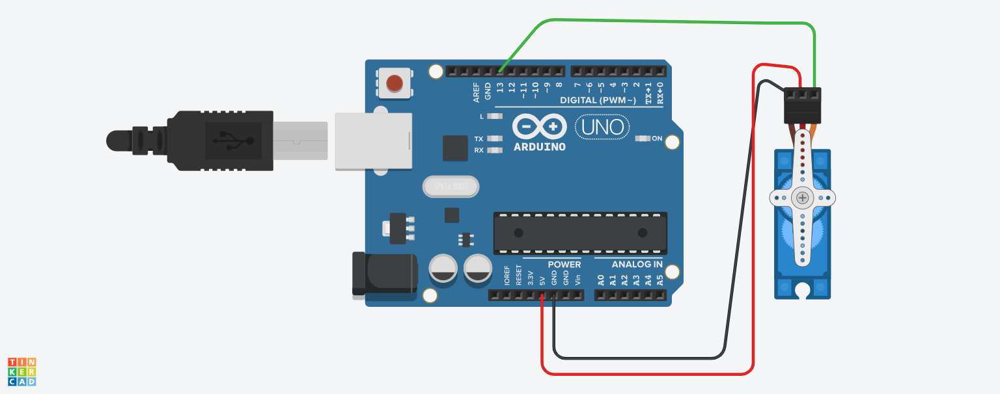
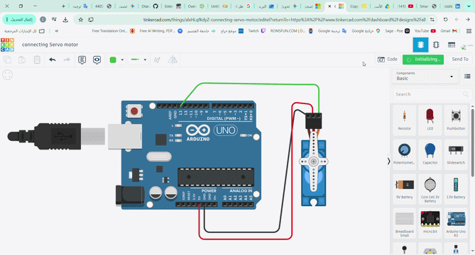

# Single Servo Motor Sweep with Pause

An Arduino project that controls a single servo motor on Pin 13, continuously sweeping from 0 to 180 degrees and pausing for 3 seconds after each sweep.

---

## 📷 Circuit / Hardware Design

*Replace `path/to/your/circuit-image.png` with your image link or drag and drop your image here.*

---

## 🎬 Simulation Demo

*Replace `path/to/your/simulation.gif` with your GIF link or drag and drop your GIF here.*

---

## 📌 Hardware Configuration

* **Microcontroller:** Arduino (Uno / Nano / Mega)
* **Servo Signal Pin:** Pin 13

---

## 📂 Repository Structure

* `main.ino` - Main Arduino C++ code file.
* `README.md` - Project documentation and demo preview.
